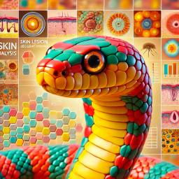
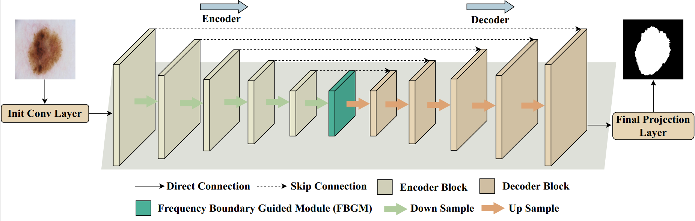
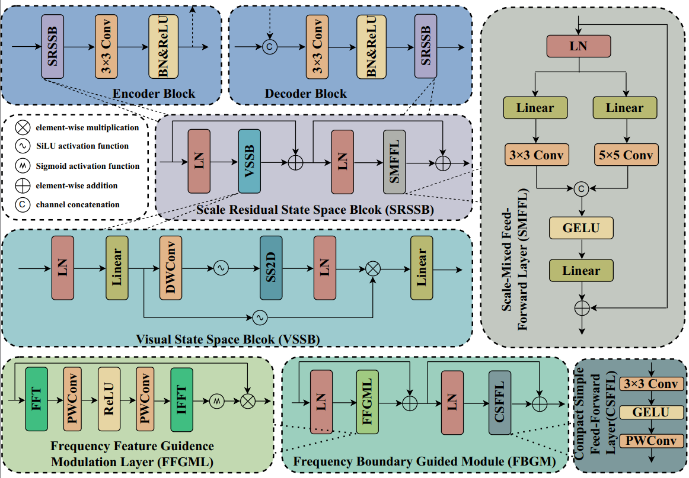
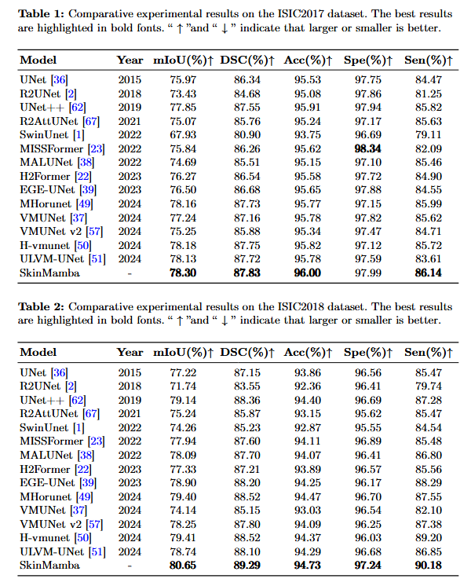

<div align="center">

<h3>SkinMamba: A Precision Skin Lesion Segmentation Architecture with Cross-Scale Global State Modeling and Frequency Boundary Guidance</h3>

[[`Paper`](https://arxiv.org/abs/2409.10890)] 
[[`Project Page`]()]


</div>

## Abstract
Skin lesion segmentation is a crucial method for identifying early skin cancer. In recent years, both convolutional neural network (CNN) and Transformer-based methods have been widely applied. Moreover, combining CNN and Transformer effectively integrates global and local relationships, but remains limited by the quadratic complexity of Transformer. To address this, we propose a hybrid architecture based on Mamba and CNN, called SkinMamba. It maintains linear complexity while offering powerful long-range dependency modeling and local feature extraction capabilities. Specifically, we introduce the Scale Residual State Space Block (SRSSB), which captures global contextual relationships and cross-scale information exchange at a macro level, enabling expert communication in a global state. This effectively addresses challenges in skin lesion segmentation related to varying lesion sizes and inconspicuous target areas. Additionally, to mitigate boundary blurring and information loss during model downsampling, we introduce the Frequency Boundary Guided Module (FBGM), providing sufficient boundary priors to guide precise boundary segmentation, while also using the retained information to assist the decoder in the decoding process. Finally, we conducted comparative and ablation experiments on two public lesion segmentation datasets (ISIC2017 and ISIC2018), and the results demonstrate the strong competitiveness of SkinMamba in skin lesion segmentation tasks. The code is available at https://github.com/zs1314/SkinMamba
## Overview
<p align="center">
  
</p>
<p align="center">
  
</p>

## 🔥The performance of SkinMamba
<p align="center">
  
</p>

---

## 💎Let's Get Started!
### `A. Installation`

Note that the code in this repo runs under **Linux** system. 

The repo is based on the [VMama repo](https://github.com/MzeroMiko/VMamba), thus you need to install it first. The following installation sequence is taken from the VMamba repo. 

**Step 1: Clone the repository:**

Clone this repository and navigate to the project directory:
```bash
git clone https://github.com/zs1314/SkinMamba.git
cd SkinMamba
```


**Step 2: Environment Setup:**

It is recommended to set up a conda environment and installing dependencies via pip. Use the following commands to set up your environment:

***Create and activate a new conda environment***

```bash
conda create -n SkinMamba
conda activate SkinMamba
```

***Install dependencies***

```bash
cd kernels/selective_scan && pip install .
pip install packaging
pip install timm==0.4.12
pip install pytest chardet yacs termcolor
pip install submitit tensorboardX
pip install triton==2.0.0
pip install causal_conv1d==1.0.0  
pip install mamba_ssm==1.0.1  
pip install scikit-learn matplotlib thop h5py SimpleITK scikit-image medpy yacs
```

### `B. Data Preparation`

### ISIC datasets
- The ISIC17 and ISIC18 datasets, divided into a 7:3 ratio, can be found here [Baidu](https://pan.baidu.com/s/110UCO8MVugAKH2U3DhFqaQ?pwd=1314 ) or [GoogleDrive](https://drive.google.com/file/d/1iKMfmlovsF32Gxc7C5WWnFeuYfOnhLs_/view?usp=sharing). 

- After downloading the datasets, you are supposed to put them into './data/isic17/' and './data/isic18/', and the file format reference is as follows. (take the ISIC17 dataset as an example.)

- './data/isic17/'
  - train
    - images
      - .png
    - masks
      - .png
  - val
    - images
      - .png
    - masks
      - .png

- './data/isic18/'
  - train
    - images
      - .png
    - masks
      - .png
  - val
    - images
      - .png
    - masks
      - .png


### `C. Model Training and Testing`


```bash
python train.py 
```
🐥: Before training and testing, configure the relevant parameters `configs/config_setting.py` 

### `D. Get model weights`
You can download the model weights (SkinMamba) from here: [Baidu](https://pan.baidu.com/s/1kyQMFuDUe0Um6v9bhMVqwA?pwd=1314) or [GoogleDrive](https://drive.google.com/file/d/1ialdv8WJoKEZkkwiqGuleEWnXOyyUEoW/view?usp=sharing)

### `E. Obtain the Outputs`
After training, you could obtain the results in './results/'

## 🤝Acknowledgments
This project is based on VMamba ([paper](https://arxiv.org/abs/2401.10166), [code](https://github.com/MzeroMiko/VMamba)). Thanks for their excellent works!!

## 🙋Q & A
***For any questions, please feel free to [contact us.](zs@stu.njau.edu.cn)***
## 📜Reference

If this code or paper contributes to your research, please kindly consider citing our paper and give this repo ⭐️ 🌝
```

```


